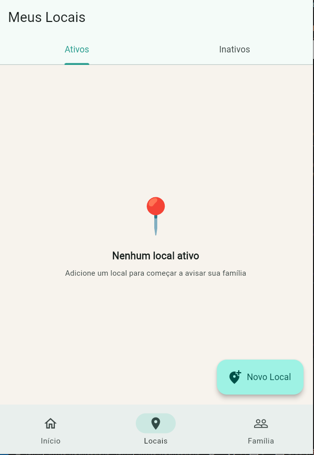
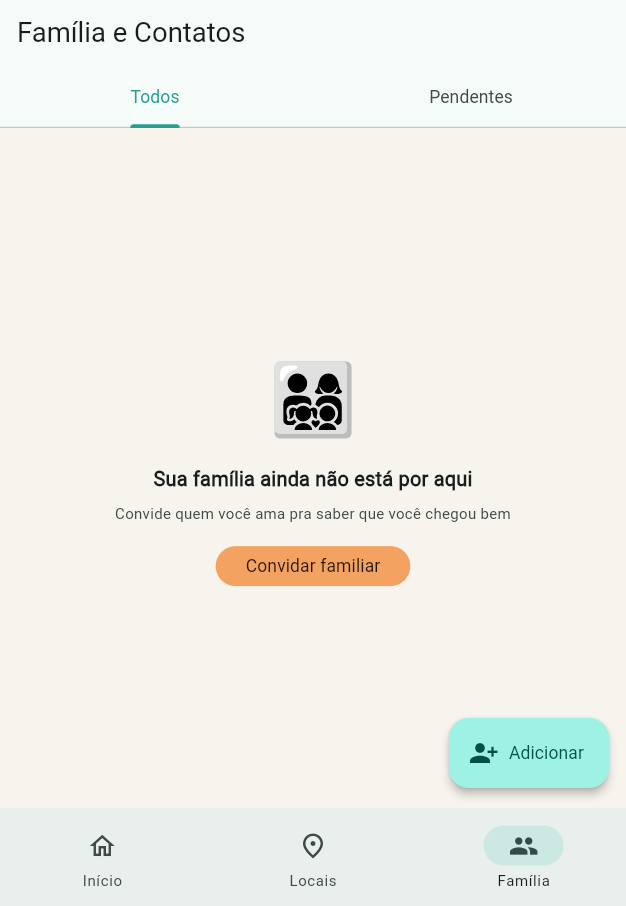
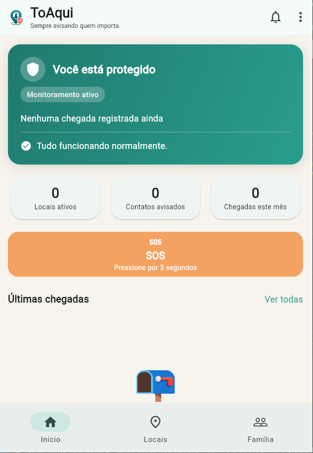
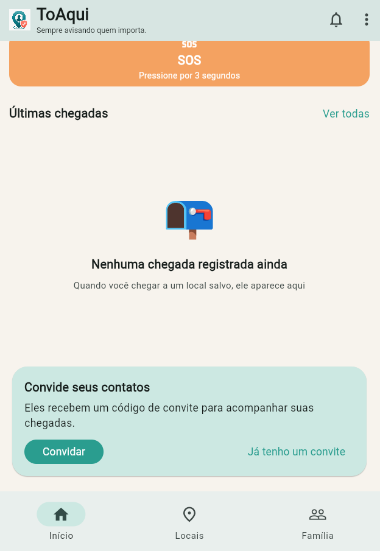

<p align="center">
  
</p>

<h1 align="center">ToAqui — Segurança para quem importa</h1>

<p align="center">
  Aplicativo mobile desenvolvido em Flutter e Firebase para facilitar o acompanhamento e a
  comunicação entre familiares e pessoas de confiança, com localização, alertas de emergência
  e notificações.
</p>

<p align="center">
  
  
  
  
</p>

---

Comecei o ToAqui pensando numa coisa bem simples: por que ainda mandamos "cheguei bem" por
mensagem de texto, na mão, todo santo dia? Quem tem alguém que se preocupa — um filho voltando
sozinho da escola, um pai idoso morando perto, um parceiro chegando tarde do trabalho — sabe
que esse "avisa quando chegar" vira rotina, e às vezes falha justo na hora que mais importa.

O ToAqui automatiza esse aviso e, mais importante, dá um jeito rápido de pedir ajuda: um botão
de emergência que funciona mesmo com a internet ruim ou sem GPS disponível, porque numa hora
dessas o alerta não pode esperar.

## 📱 Conheça o ToAqui

<table>
  <tr>
    <td align="center" width="33%">
      <br />
      <b>🏠 Home</b><br />
      <sub>Status de monitoramento e chegadas recentes da família</sub>
    </td>
    <td align="center" width="33%">
      <br />
      <b>📍 Localização</b><br />
      <sub>Locais cadastrados, com ícone e status ativo/inativo</sub>
    </td>
    <td align="center" width="33%">
      <br />
      <b>👨‍👩‍👧 Pessoas de confiança</b><br />
      <sub>Quem está conectado e quem ainda tem convite pendente</sub>
    </td>
  </tr>
  <tr>
    <td align="center" width="33%">
      <br />
      <b>🚨 Emergência</b><br />
      <sub>Segurar por 3 segundos envia um alerta com localização</sub>
    </td>
    <td align="center" width="33%">
      <br />
      <b>🔗 Convite</b><br />
      <sub>Código de 6 caracteres, sem precisar de e-mail ou senha</sub>
    </td>
    <td align="center" width="33%">
      <br />
      <b>🔔 Notificações</b><br />
      <sub>Push em tempo real quando alguém chega ou pede ajuda</sub>
    </td>
  </tr>
</table>

> 🎬 **Fluxo de convite em GIF** — criar convite → compartilhar código → pessoa entra → aparece
> como conectado. *(em breve — ver `docs/screenshots/README.md` para como gravar)*

## ⚙️ Principais funcionalidades

**Frontend**
- Flutter + Dart, com gerenciamento de estado reativo (Riverpod)
- Navegação declarativa com `go_router`
- App multiplataforma: Android, iOS e Web a partir de uma única base de código

**Backend**
- Firebase (Authentication, Cloud Firestore, Cloud Messaging)
- Cloud Functions em TypeScript, disparadas por eventos do banco de dados
- Regras de segurança do Firestore escritas por coleção, com testes dedicados

**Recursos**
- 📍 Geolocalização (cadastro de locais + simulação/registro de chegada)
- 🔔 Notificações push em tempo real
- 🔗 Sistema de convites (vínculo entre contas sem senha)
- 🚨 Alertas de emergência com garantia de envio

## 🔄 Como o projeto funciona

```
1. O app abre e cria uma identidade anônima automaticamente
   (sem tela de cadastro, sem e-mail, sem senha)
                    ↓
2. A pessoa cadastra os locais que importam (casa, trabalho, escola)
   e adiciona quem ela quer manter por perto (a família)
                    ↓
3. Pra cada pessoa adicionada, o app gera um código de convite
   de 6 caracteres, válido por 24 horas e de uso único
                    ↓
4. A pessoa convidada abre o app, digita o código em
   "Tenho um convite" e as duas contas são vinculadas no Firestore
                    ↓
5. A partir daí, toda chegada registrada — ou todo alerta de
   emergência — dispara uma Cloud Function, que busca os contatos
   vinculados e envia a notificação push pra eles
                    ↓
6. As regras de segurança do Firestore garantem, o tempo todo, que
   cada pessoa só acessa os próprios dados e o que foi
   explicitamente compartilhado com ela
```

## 🧠 Decisões técnicas

**Por que Flutter?**
Pra manter uma única base de código cobrindo Android, iOS e Web, sem abrir mão de uma
interface nativa e responsiva. Como o projeto lida com permissões sensíveis (localização,
notificações), também pesou o acesso maduro do Flutter aos plugins nativos dessas APIs.

**Por que Firebase?**
Pra não precisar manter um servidor rodando 24 horas por dia só pra escutar "alguém chegou" ou
"alguém apertou o botão de emergência". O Firestore guarda os dados, e Cloud Functions reagem
a eventos (a criação de um documento) pra disparar as notificações — o backend inteiro é
orientado a evento, sem infraestrutura própria pra manter no ar.

**Por que autenticação anônima em vez de cadastro tradicional?**
Porque o cadastro tradicional é atrito puro pra esse caso de uso: ninguém quer criar senha só
pra avisar que chegou em casa. A identidade anônima resolve "quem é essa pessoa no sistema", e
o convite por código resolve "como ela se conecta à família dela" — sem precisar de nenhuma das
duas coisas depender de e-mail.

**Por que testar as regras do Firestore separadamente?**
Testes de widget e de repositório, sozinhos, não garantem que as regras de segurança do banco
de dados estão corretas — eles rodam contra um Firestore falso, que não aplica regra nenhuma.
Foi exatamente assim que uma falha real passou despercebida por várias rodadas de revisão neste
projeto: as regras permitiam, sem querer, que uma pessoa vinculasse a própria conta ao contato
pendente de outra família. A correção veio junto com uma suíte de testes dedicada, rodando
contra o emulador do Firestore, validando especificamente o que cada regra permite e proíbe.

**Por que o botão de emergência nunca pode "travar"?**
Porque numa emergência real, esperar o app não é uma opção. O fluxo de envio tem um limite de
tempo único para toda a etapa de localização (incluindo a permissão do sistema, que sozinha
pode ficar esperando resposta indefinidamente) — se a localização não vier a tempo, o alerta
sai mesmo assim, só que sem coordenadas.

## 🧪 Testes

- **Flutter**: testes de widget e de unidade cobrindo telas, providers e repositórios
- **Cloud Functions**: testes de integração rodando contra o emulador do Firestore
- **Regras de segurança**: suíte dedicada validando o que cada perfil de usuário pode e não
  pode ler/escrever no banco de dados

## 🚀 Como rodar o projeto

Pré-requisitos: [Flutter SDK](https://docs.flutter.dev/get-started/install), um projeto
Firebase próprio (Auth anônimo + Firestore habilitados) e o
[Firebase CLI](https://firebase.google.com/docs/cli).

```bash
# instalar as dependências do app
flutter pub get

# rodar os testes do app
flutter test

# rodar o app (escolha um dispositivo/emulador disponível)
flutter run
```

Para o backend (Cloud Functions):

```bash
cd functions
npm install
npm run build

# rodar os testes contra o emulador do Firestore
firebase emulators:exec --only firestore "npm test"
```

> Este repositório não inclui chaves ou credenciais do Firebase de produção. Para rodar o
> projeto localmente, configure seu próprio projeto Firebase e gere o
> `lib/firebase_options.dart` com o [FlutterFire CLI](https://firebase.flutter.dev/docs/cli).
